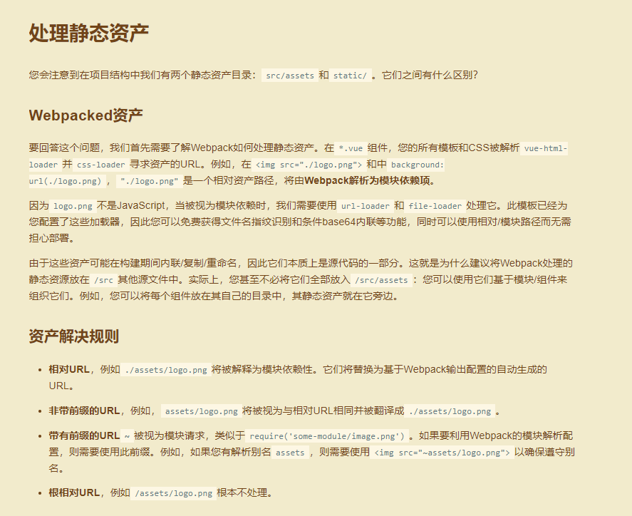

# web前端规范
## §1、概述
**人多不一定力量大，还有可能一团糟。**<br>
规范的目的：统一、高效、便于维护
<br><br>

## §2、文件规范
### §2.1、文件命名规则
#### §2.1.1、总体原则
**1、默认小写字母，专有名词可大写：**<br>
**1）文件夹/文件：字母+数字+下划线**<br>
**2）css：字母+数字+中划线**<br>
**3）js（方法/变量）：字母+数字+驼峰式**<br>
2、杜绝拼音，统一用英文，中英文翻译参照百度翻译。<br>
3、共性信息在前，个性信息在后。<br>
4、大范围在前，小范围在后。<br>
5、重要在前，次要在后。

#### §2.1.2、图片文件命名原则
1、主目录--images<br>
2、子目录：每次项目迭代，新建子目录存放图片，子目录命名规则为：<br>
&nbsp;&nbsp;&nbsp;&nbsp;&nbsp;“ 年月_迭代主题 ”，如 Sep18_init：2018年9月项目初始化<br>
3、图片目录结构大体如下：
```
├─images
  ├─UI_April18
  ├─...
```
4、图片命名规则<br>
**1）命名加上属性前缀**<br>

|前缀      | 含义|
|----------|------|
|back_     | 背景图片|
|banner_   | banner图|
|code_     | 码图（如二维码）|
|default_  | 默认图片|
|figure_   | 配图|
|icon_     | 图标|
|logo_     | logo|
|nodata_   | 无数据图|
|photo_    | 头像|
例：icon_star&nbsp;&nbsp;&nbsp;&nbsp;photo_doctor

### §2.2、垃圾回收机制
1、在src同级目录下，建useless文件夹，专门用于存放暂时无用的垃圾文件，并定期清理。<br>
ps：src同级文件不参与打包，不会影响包大小。<br>
2、删改内容后注意观察全局<br>
1）确定无用则删掉<br>
2）将来可能有用，则移入useless文件夹。
<br><br>

## §3、样式规范
**样式统一用scss语法**<br>
详见 [水果样式理论](./水果样式理论.md)
<br><br>

## §4、代码规范
### §4.1、注释
1、方法要加注释<br>
2、易混淆的变量和逻辑要加注释
### §4.2、方法命名
驼峰式：动词+名词形式，体现动作和作用对象
### §4.3、变量命名
**1、驼峰式**<br>
**2、特殊用途、或有某种含义的用固定前缀**

|前缀 | 含义 | 类型 | 用法示例|
|----|------|----|----|
|if   | v-if的变量    | Boolean | v-if="ifList"|
|show | v-show的变量  | Boolean | v-show="showList"|
|is   | 表示"是不是"含义的  | Boolean | isCheck|
|has   | 表示"有没有"含义的  | Boolean | hasList|
|able   | 表示"能不能"含义的  | Boolean | ableSubmit // true能，false不能<br>:disabled="!ableSubmit"|
|img   | 表示图片  | String | imgList|
### §4.4、代码格式（以下设置是针对vscode编辑器的）
1、**语句结尾不加分号，依据eslint规则。**<br>
2、tab缩进，空格4<br>
1）文件-首选项-设置<br>
2）加入以下设置
```
    "editor.tabSize": 4,
```
3、eslint代码校验，统一代码格式<br>
1）安装ESLint插件<br>
2）文件-首选项-设置<br>
3）加入以下设置，保存文件即可自动按eslint规则格式化
```
    "eslint.autoFixOnSave": true,
    "eslint.validate": [
        "javascript",{
            "language": "vue",
            "autoFix": true
        },"html",
        "vue"
    ]
```
4、常用快捷键设置<br>
1）文件-首选项-快捷键 -> keybindings.json<br>
2）加入以下快捷键
```
// 将键绑定放入此文件中以覆盖默认值
[
  // ctrl+d 删除当前行
  {
    "key": "ctrl+d",
    "command": "editor.action.deleteLines",
    "when": "editorTextFocus && !editorReadonly"
  },
  // ctrl+shift+d 复制当前行到下一行
  {
    "key": "ctrl+shift+d",
    "command": "editor.action.copyLinesDownAction",
    "when": "editorTextFocus && !editorReadonly"
  },
  // ctrl+shift+/ 多行注释
  {
    "key": "ctrl+shift+/",
    "command": "editor.action.blockComment",
    "when": "editorTextFocus"
  }
]
```
5、推荐安装插件<br>
Auto Close Tag：自动闭合标签

### §4.5、细节
#### §4.5.1、v-for循环
1、一级循环<br>
&nbsp;&nbsp;&nbsp;&nbsp;&nbsp;&nbsp;v-for="(item, index) in mainList"<br>
&nbsp;&nbsp;&nbsp;&nbsp;&nbsp;&nbsp;v-for="(item, index) in mainList2"<br>
&nbsp;&nbsp;&nbsp;&nbsp;&nbsp;&nbsp;ps: 可在数据定义处注释mainList的含义<br>
2、二级循环：j标识<br>
1）一般：<br>
&nbsp;&nbsp;&nbsp;&nbsp;&nbsp;&nbsp;v-for="(jitem, jindex) in item.xxx"<br>
2）特殊：<br>
&nbsp;&nbsp;&nbsp;&nbsp;&nbsp;&nbsp;v-for="(jitem, jindex) in jmainList"<br>
&nbsp;&nbsp;&nbsp;&nbsp;&nbsp;&nbsp;v-for="(jitem, jindex) in mainList2"<br>
3、三级循环：k标识

#### §4.5.2、无数据
1、规则定义<br>
1）nodata = null  初始化<br>
2）nodata === true  无数据（true可省略）<br>
3）nodata === false 有数据（一般用不上）<br>
2、用法<br>
1）定义全局方法<br>
```
switchNodata (list) {
  return !list || list.length === 0
}
```
2）数据请求得到结果<br>
```
xxx.then(res => {
  this.list = res.data
  this.nodata = this.$util.switchNodata(this.list)
})
```
3）html
```
<empty v-if="nodata">无数据</empty>
```
3、无数据组件
```
<div v-show="visible">
  <div v-if="type==='xxx'">
    <slot v-if="hasSlot">
    </slot>
    <slot v-else>
        <p>xxxxxx</p>
    </slot>
  </div>
</div>
props: {
  visible: {
    type: Boolean,
    required: true
  },
  type: {
    type: Boolean,
    required: false
  }
  hasSlot: {
    type: Boolean,
    default: false,
    required: false
  }
}
```
<br><br>

## §5、git规范
### §5.1、建分支的原则
1、git分支为成员协作服务<br>
2、协作是以功能模块为单位<br>
### §5.2、建分支的场景
当多人进行同一个功能模块的开发，缺乏一个方便协作的分支时，才去建分支。
### §5.3、分支命名
1、分支命名，不用局限于人、或功能模块，便于理解达成共识即可。<br>
2、小写字母、中划线。
### §5.4、git commit 注释规范
1、一般情况下，提交git时的注释可以分成几类，可以用几个动词开始：<br>
1）added: 新加入的需求<br>
2）fixed: 修复 bug<br>
3）changed: 完成的任务<br>
4）updated: 更新的任务<br>
2、概述提交内容，有多条的话，分别罗列1、2、3。
<br><br>

## §6、项目框架规范
### §6.1、框架设计
详见 [框架设计](./框架设计.md)
### §6.2、图片资源存储与引用
### §6.2.1、src/assets和static的区别
详见 [vuejs处理静态资产](http://vuejs-templates.github.io/webpack/static.html)<br><br>


### §6.2.2、图片资源存储
**统一存放在src/assets/images文件夹下**

### §6.2.3、图片资源引用
1、给'src/assets/images'路径配置一个默认标识符：'~'，便于图片和其他资源区分，单独管理。
```
webpack.base.conf.js:
'~': resolve('src/assets/images')
```
**2、image标签src引入：用于一般配图**
```
html:
<image :src="imgXxx" style="width: 200rpx; height: 200rpx;"></image>
js:
data: () => ({
    imgXxx: require('~/Sep18_init/figure_xxx.png')
})
```
**3、样式background引入：用于图标<br>**
```
main.scss:
// 图标
$theicons:
(truck, 60, 60),
(truck, 50, 50);
@each $icon, $width, $height in $theicons {
  .theicon-#{$icon} {
    display: inline-block;
    width: #{$width}rpx;
    height: #{$height}rpx;
    background: url(../images/Sep18_init/icon_#{$icon}.png) no-repeat;
    background-size: 100% 100%;
  }
}
```
**ps: css中一定要用相对路径，才会被解释为模块依赖，编译生成base64编码。所以，将需要用background去引用图片的样式，集中放在同一个样式文件（如：main.scss）进行统一管理。**

## §7、CodeReview跟踪
### §7.1、小程序CodeReview
详见 [小程序CodeReview记录](./小程序CodeReview记录.md)
<br><br>
<br><br>

<p style="font-size: 12px">版权归卓建科技掌上医院-自运营平台前端团队所有，翻版必究！</p>