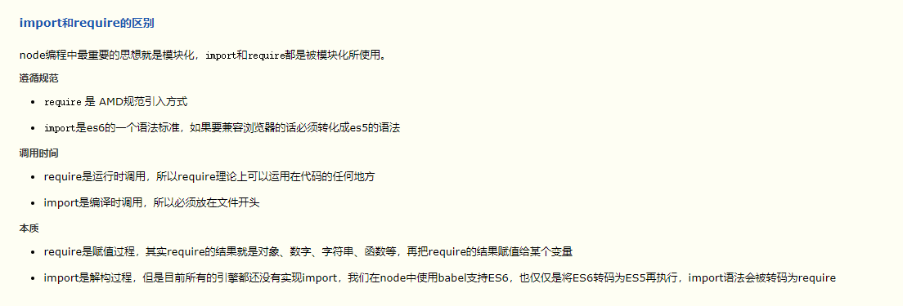
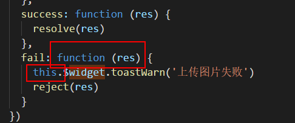
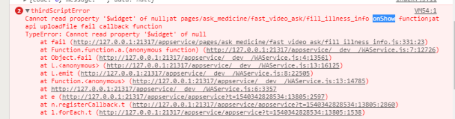

# 小程序CodeReview记录
## 20180903 - CodeReview 1<sup>st</sup>
1、细节<br>
1）高度尽量不写死，用padding撑；<br>
2）样式用scss语法；<br>
3）拆解不必要的个性化样式；<br>
4）表格用固定rpx宽度<br>
2、药企、药店列表数据格式<br>
3、方法名尽量用动词+名词形式命名<br>
4、中英文统一用百度翻译<br>
5、.flex-baseline  .flex-align-spacebetween 等flex相关的经典样式很常用，多了解下<br>
6、v-for循环的标准命名方式，入标准<br>
7、图片存放位置，static/assets，调研下，入标准<br>
8、button简写用btn，list不用加s等细节需注意<br>
9、9.6号，前端静态页面（小程序和药店公用）全部完成<br>

## 20180929 - CodeReview 2<sup>nd</sup>
1、上个页面传进来的type等难分辨的变量，要明确注释<br>
2、统一书写顺序：<br>
1）小程序：
- mixin
- components
- props
- data
- computed
- watch
- onLoad
- onShow
- onHide
- mounted
- methods
- update

2）vue：
- mixin
- components
- props
- data
- computed
- watch
- created
- mounted
- activited
- update
- beforeRouteUpdate
- methods
- filter
<br>

3、若页面加载进来有脏数据，用以下代码初始化，而不是一一赋值<br>
```
  onLoad () {
    Object.assign(this, this.$options.data())
  }
```
4、post请求尽量独立成方法<br>
5、方法名尽量顾名思义，长一些也ok<br>
6、类似下订单这种，防止用户重复点击的页面，用replace重定向跳转下一个页面<br>
7、异步方法用async代替promise，[两者比较](https://www.cnblogs.com/fundebug/p/6667725.html)<br>
示例：
```
<!-- async方法定义 -->
// 获取就诊人列表
/*
* type: 0请求参数初始化，1特定请求参数，默认0
*/
async getPatientList(type = 0) {
    if (type === 0) {
        this.params = {
            selectcontent: '',
            pageNo: '1',
            pageSize: '5'
        }
    }
    await this.$post({
        url: this.$api.patientList + `?selectcontent=${this.params.selectcontent}&pageNo='${this.params.pageNo}&pageSize=${this.params.pageSize}`
    }).then(res => {
        if (res.data.code === 0) {
            this.patientList = res.data.data.messageDTOList
        }
    })
}
<!-- async方法调用 -->
// 在异步方法调用
async demo1() {
    await this.getPatientList()
    this.checkedPatient = this.patientList[0]
}
// 在普通方法调用
demo2 () {
    this.getPatientList().then(() => {
        this.checkedPatient = this.patientList[0]
    })
}
```

## 20181008 - CodeReview 3<sup>rd</sup>
1、isShowXxx 统一改用 showXxx<br>
2、单页面尽量避免写原子样式，常用的原子样式，归并到global.scss中<br>
3、主题色，修改类名为color-theme，用到主题色的地方统一改用类名<br>
4、小程序的webpack设置中默认大于10K的图片，css的background无法加载，只能通过src的方式请求<br>
5、import与require的区别<br><br>
<br>
使用场景<br>
1）一定需要用到的资源用import引入<br>
2）根据条件动态判断需要的资源可以用require引入<br>
6、返回上一页统一用$router.back()方法，不用$router.go()<br>
7、单页面定义色值类的时候，不要用color-前缀，统一用thecolor-前缀<br>
8、清除浮动用全局样式 .clear { overflow: hidden } 见global.scss<br>
9、标签属性书写顺序：v-if/v-show 放最前面<br>
10、为方便代码移植，import资源用绝对路径：“@/xxx”，如：
```
import empty from '@/components/empty'
import { getAddress } from '@/utils/map'
```

## 20181030 - CodeReview 4<sup>th</sup>
**1、获取列表格式规范**<br>
例：翻页列表，以小程序为例（不翻页在此基础上简化）
```
// 列表只需加载一次用onLoad，返回该页面会导致列表数据改变用onShow
onLoad/onShow () {
    wx.startPullDownRefresh()
}
// 下拉刷新
onPullDownRefresh () {
    this.getXxxList(true, false).then(() => {
      wx.stopPullDownRefresh()
    })
},
// 上拉翻页
onReachBottom () {
    this.getXxxList(false, true)
},
// 获取xxx列表
async getXxxList (isRefresh, isLoading) {
    if (isRefresh) {
        this.pageNo = 1
        this.mainList = []
    } else {
        this.pageNo++
    }
    await this.$post({
        isLoading: isLoading,
        loadingText: '数据加载中...',
        url: this.$apis.list,
        param: {
          pageNo: this.pageNo,
          pageSize: this.pageSize,
          ...
        }
    }).then(res => {
        this.mainList = this.mainList.concat(res.data.list)
        this.nodata = this.$util.switchNodata(this.mainList)
    }, () => {
        this.nodata = true
    })
},
```
2、字段为空的时候，为避免盒模型冗余，注意几个情况：<br>
1）界面不要出现null<br>
2）分隔符不要单独出现<br>
3）这个节点的padding、margin都不要出现，以免影像后面元素的展现。因此margin、border一般是给后面的元素写top和left，也有例外的，视情况而定。<br>
**总之就是节点为空的时候，这个节点完全消失，跟它相关的也完全消失！**<br>
A：什么是相关的？<br>
Q：在写之前就要考虑到什么是相关的元素，比如分隔符，是为哪个元素服务的，就是跟谁相关的。<br>

3、van-ui组件中，动画效果有两个组件，popup和transition<br>
1）折叠展开之类，用transition<br>
2）城市下拉树之类，用popup<br>

4、van-ui组件中，单页面重写组件样式/custom-class自定义的样式/特定环境复用的水果拼盘样式，参照如下写法：<br>
另起一个style，不加scoped。如图：<br>
<br>

5、注意this指向，尤其拷贝组件代码的时候<br>
<br>
<br>
这种问题注意下，这种this指向会有问题，统一用箭头函数<br>
**拓展：this的指向<br>
跟别的语言大相径庭的是，js的this总是指向一个对象，而具体指向哪个对象是在运行时基于函数的执行环境动态绑定的，而非函数被声明时的环境。es6中箭头函数的this指向有所不同，指向声明时的环境而非运行时的环境，原因是箭头函数内部没有this，它的this就是外部代码块的this。this的四种用法：<br>
1）作为对象的方法调用<br>
指向该对象<br>
2）作为普通函数调用<br>
指向全局对象<br>
3）构造器调用<br>
指向构造器返回的这个对象<br>
4）Function.prototype.call或Function.prototype.apply调用<br>
动态的改变传入函数的this**<br>

6、区分route对象和router对象<br>
route.query<br>
router.push()<br>

**7、type变量值视情况变化，一定要注释清楚**<br>
1）婉约派：用0、1代表含义<br>
2）豪放派：直抒胸臆，如type: "" // sp=>视频 tw=>图文<br>

**8、方法要加注释，并且注释基于0认知，不要用特定交流环境下的陌生名词**<br>

9、上传图片并提交的一般的逻辑是，提交的时候再做上传操作，上传成功之后调提交的接口<br>
```
// 上传图片接口
uploadOneImg (index) { // 后台只能一张一张传
    return new Promise((resolve, reject) => {
        if (this.filePathsArr.length === 0) {
          return resolve('complete')
        }
        wx.uploadFile({
          url: apis.uploadFeedBackImage,
          filePath: this.filePathsArr[index].path,
          name: 'file',
          header: this.header,
          formData: {
            belong: this.belong,
            type: 1
          },
          success: res => {
            this.filePathsArr[index].id = JSON.parse(res.data).data.id
            if (index < this.filePathsArr.length - 1) {
              resolve(this.uploadOneImg(++index))
            } else {
              resolve('complete')
            }
          },
          fail: res => {
            this.$widget.toastWarn('上传图片失败，请重试')
            this.ableSubmit = true
            reject(res)
          }
        })
    })
},
// 提交
submitFeedBack () {
    wx.showLoading({
        title: '处理中...',
        mask: true
    })
    this.uploadOneImg(0).then(res => {
        if (res === 'complete') {
            ...
            wx.showLoading()
        }
    })
}
```
10、尽量组件化，不要把一个页面的代码搞复杂化，一个文件中代码不要太长
<br><br>
<br><br>

<p style="font-size: 12px">版权归卓建科技掌上医院-自运营平台前端团队所有，翻版必究！</p>